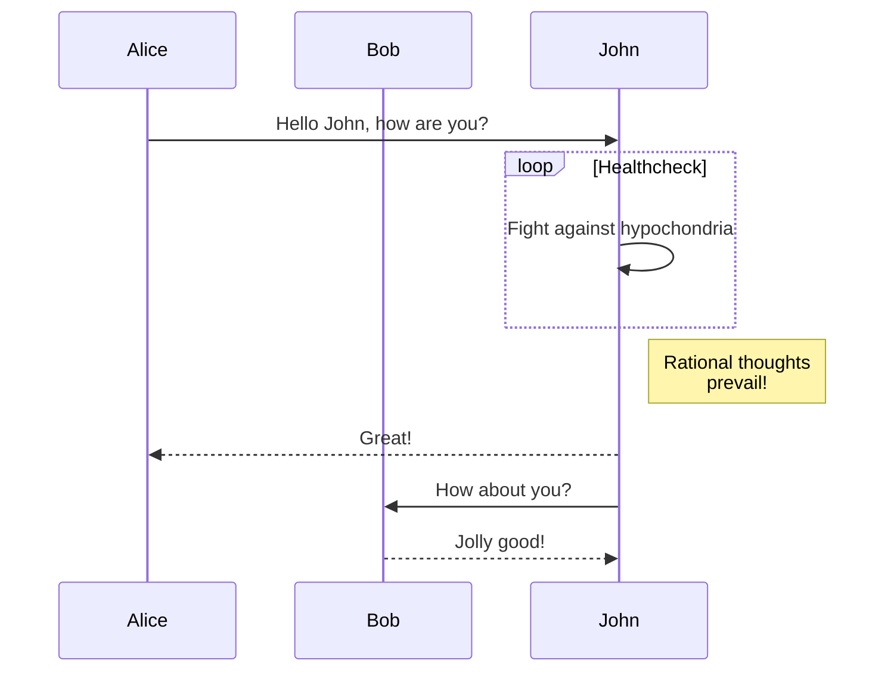

```

Asterisks  
<!-- markdownlint-disable MD035 -->
***

Underscores  
___

Minus signs

---
<!-- markdownlint-enable MD035 -->
When using minus signs an empty line is required before the 3 minus signs.

[Top^](#markdown)

## Footnotes

Footnotes aren't supported by all Markdown parsers, but many do.

```text
My first single line footnote[^1].

This will be a footnote with multiple lines[^2].  

It doesn't have to be numbers, words can also be used[^mynote]. However, it will be replaced by a number when rendered.

The footnotes can be placed anywhere in the document, but when rendered, will be placed at the bottom of the page.

[^1]: This is my footnote.  
[^2]: The first line is post-fixed with 2 spaces .  
  The second line is pre-fixed with two spaces.  
[^mynote]:
    A footnote with a name, will still result in a number, but is easier for identification perhaps.  
    A footnote formatted like this needs to be prefixed with 4 characters for every new line.
```

My first single line footnote[^1].

This will be a footnote with multiple lines[^2].

It doesn't have to be numbers, words can also be used[^mynote]. However, it will be replaced by a number when rendered.

The footnotes can be placed anywhere in the document, but when rendered, will be placed at the bottom of the page.

[^1]: This is my footnote.
[^2]: The first line is post-fixed with 2 spaces.
  The second line is pre-fixed with two spaces.
[^mynote]:
    A footnote with a name, will still result in a number, but is easier for identification perhaps.\
    A footnote formatted like this needs to be prefixed with 4 characters for every new line.

[Top^](#markdown)

## Tables

Tables aren't supported by all Markdown parsers, but many do.  
Tables are created by using pipes `|` and dashes `-`.

```text
| Tables   | Are      | Cool     |  
|----------|----------| ---------|  
| column 1 | column 2 | column 3 |  
| Another  | row      | here     |  
```

| Tables   | Are      | Cool     |  
|----------|----------| ---------|  
| column 1 | column 2 | column 3 |  
| Another  | row      | here     |  

There must be at least 3 dashes separating each header cell.
The outer pipes (|) are optional, and you don't need to make the raw Markdown line up prettily.  
Also inline Markdown is supported.

```text
Markdown | Less | Pretty  
--- | --- | ---  
*Still* | `renders` | **nicely**  
1 | 2 | 3  
```

Markdown | Less | Pretty  
--- | --- | ---  
*Still* | `renders` | **nicely**  
1 | 2 | 3  

Colons can be used to align the columns.  
A colon at the left followed by a minimum of 3 dashes aligns the column to the left.  
A colon at the right preceded by a minimum of 3 dashes aligns the column to the right.  
A colon at both the left and right with between them at least 3 dashes, centers the column.

```text
| Tables        | Are           | Cool  |  
| ------------- |:-------------:| -----:|  
| col 3 is      | right-aligned | $1600 |  
| col 2 is      | centered      |   $12 |  
```

| Tables        | Are           | Cool  |  
| ------------- |:-------------:| -----:|  
| col 3 is      | right-aligned | $1600 |  
| col 2 is      | centered      |   $12 |

The alignment of the columns in Hugo is achieved by applying a style to the HTML table columns. If however Content-Security-Policy is active, like in Hinode and on this site, the styling is blocked. Resulting in the alignment not working. Hinode provides a solution for that by adding the option to use classes.

### Hinode additional options

Hinode adds enhancements to displaying tables. Add `{.table}` at the bottom of the block to apply the correct styling. You can mix the content with inline Markdown.

```text
| Italics   | Bold     | Code   |
| --------- | -------- | ------ |
| *italics* | **bold** | `code` |
{.table}
```

| Italics   | Bold     | Code   |
| --------- | -------- | ------ |
| *italics* | **bold** | `code` |
{.table}

There are more enhancements in Hinode related to tables, which can be found here.

[Top^](#markdown)

## Formula

Formulas are not supported by all Markdown parsers. If they are then they use the LaTex markup. This is a useful reference. An editor to try it out can be found on CodeCogs.  
A formula line is prefixed and postfixed with a single dollar sign (inline formula) or a double dollar sign.

```text
This is an inline $-b \pm \sqrt{b^2 - 4ac} \over 2a$ formula
$$x = a_0 + \frac{1}{a_1 + \frac{1}{a_2 + \frac{1}{a_3 + a_4}}}$$
$$\forall x \in X, \quad \exists y \leq \epsilon$$
```

This is an inline $-b \pm \sqrt{b^2 - 4ac} \over 2a$ formula  
$$x = a_0 + \frac{1}{a_1 + \frac{1}{a_2 + \frac{1}{a_3 + a_4}}}$$  
$$\forall x \in X, \quad \exists y \leq \epsilon$$

On Hinode and this site, the above shows the proper formulas, because the `Katex` module is used.

[Top^](#markdown)

## Inline HTML

it is possible to use raw html in Markdown. For the most part it will work.  
Using Markdown in HTML, usually does not work very well, so it is best to use HTML tags.

For security reasons, this option is disabled by default in HUGO, but enabled in Hinode by default.

```html
<dl>
  <dt>Definition list</dt>
  <dd>A way to create a nice looking list that is easy to do in HTML.</dd>

  <dt>Markdown in HTML</dt>
  <dd>Does *not* work **very** well. Use HTML <em>tags</em>.</dd>
</dl>
```

<dl> <dt>Definition list</dt> <dd>A way to create a nice looking list that is easy to do in HTML.</dd>

<dt>Markdown in HTML</dt> <dd>Does *not* work **very** well. Use HTML <em>tags</em>.</dd> </dl>

Use the HTML element <abbr> for abbreviations and acronyms to show the expanded version on hover. Abbreviations have a default underline and gain a help cursor to provide additional context on hover and to users of assistive technologies.

```HTML
<p><abbr title="HyperText Markup Language">HTML</abbr></p>
```

<p><abbr title="HyperText Markup Language">HTML</abbr></p>

[Top^](#markdown)

## Videos

Videos, like YouTube videos can only be added, using an image with a link in Markdown. It is not possible to define the size in that way.

```text
[](https://www.youtube.com/watch?v=j47I36LZQVc)
```

[](https://www.youtube.com/watch?v=j47I36LZQVc)

using HTML, it gives more opportunities (if HTML is supported).

```html
<a href="https://www.youtube.com/watch?feature=player_embedded&v=YOUTUBE_VIDEO_ID
" target="_blank"></a>
```

<a href="https://www.youtube.com/watch?feature=player_embedded&v=j47I36LZQVc
" target="_blank"></a>

[Top^](#markdown)

## Emojis

Emojis are supported in HUGO when the following is set in the config file: `enableEmoji = true`

Following that, it is possible to use one of the supported emoji surrounded by colon characters.

```text
:smile : :cry : :wink : 
```

Note that the space before the second colon in each of the texts, should not be used. It is used here, because Hugo renders the emojis in the code block as well.

:smile: :cry: :wink:

See here for a list of allowed emojis.

## Diagrams

HUGO supports GoAT diagrams natively.

```text
      .               .                .               .--- 1          .-- 1     / 1
     / \              |                |           .---+            .-+         +
    /   \         .---+---.         .--+--.        |   '--- 2      |   '-- 2   / \ 2
   +     +        |       |        |       |    ---+            ---+          +
  / \   / \     .-+-.   .-+-.     .+.     .+.      |   .--- 3      |   .-- 3   \ / 3
 /   \ /   \    |   |   |   |    |   |   |   |     '---+            '-+         +
 1   2 3   4    1   2   3   4    1   2   3   4         '--- 4          '-- 4     \ 4
```

To enable this in a code block, the language of te code block needs to be set to `goat`.

```goat
      .               .                .               .--- 1          .-- 1     / 1
     / \              |                |           .---+            .-+         +
    /   \         .---+---.         .--+--.        |   '--- 2      |   '-- 2   / \ 2
   +     +        |       |        |       |    ---+            ---+          +
  / \   / \     .-+-.   .-+-.     .+.     .+.      |   .--- 3      |   .-- 3   \ / 3
 /   \ /   \    |   |   |   |    |   |   |   |     '---+            '-+         +
 1   2 3   4    1   2   3   4    1   2   3   4         '--- 4          '-- 4     \ 4
```

For this the information needs to be in a code block with the language specification being 'goat'.

Note that if Content-Security-Policy is active, the result will generate a number of errors, because Hugo generates font-styles for the numbers, which will be blocked.

In Hugo, Mermaid is not supported by default, but it can be added. Check out [this link](https://gohugo.io/content-management/diagrams/#mermaid-diagrams) for more information.  
Note that when Content-Security-Policy has been enabled, the mermaid javascript file generates a lot of `style-src` blocks. This can only be prevented when `unsafe-inline` is added to the `style-src` and all hashes are removed from the list (as when a hash is present `unsafe-inline` is ignored).  
Because of this Mermaid is not supported on Hinode and this site, as using `unsafe-inline` makes Content-Security-Policy pointless.

Similar to goat, a mermaid diagram is a code block with the language set to 'mermaid'.



## Invisible information

When invisible information is needed to be stored in the markdown file, use the HTML comment tag. Irrespective of whether HTML is supported, the information in the comment tag will not be visible. The comment tag starts with `<!--` and ends with `-->`.

```html
<!-- This line will not be rendered -->
```

And outside the fenced block this line should not be visible:  
<!-- This line will not be rendered -->

Note that the start of the comment needs to be on a line of its own and can be prefixed with up to 3 spaces. With more spaces or prefixed with any other character than a space the entire comment block will be shown.
