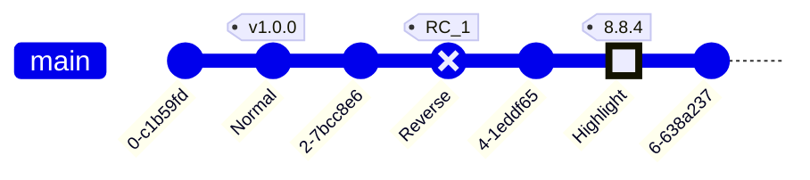

Hinode provides several shortcodes on top of the common [Bootstrap elements]({}). Refer to the [official documentation]({}) for more details.

## Animation

As an example, the following shortcode shows an animation that plays on hover.

<!-- markdownlint-disable MD037 -->



<!-- markdownlint-enable MD037 -->

## Data tables

As an example, the following shortcode displays a responsive table that uses advanced controls.

<!-- markdownlint-disable MD037 MD058 -->


|  #  | Heading |
|-----|---------|
|  1. | Item 1  |
|  2. | Item 2  |
|  3. | Item 3  |
|  4. | Item 4  |
|  5. | Item 5  |
|  6. | Item 6  |
|  7. | Item 7  |
|  8. | Item 8  |
|  9. | Item 9  |
| 10. | Item 10  |
| 11. | Item 11  |
| 12. | Item 12  |
| 13. | Item 13  |
| 14. | Item 14  |
| 15. | Item 15  |
| 16. | Item 16  |
| 17. | Item 17  |
| 18. | Item 18  |
| 19. | Item 19  |
| 20. | Item 20  |
| 21. | Item 21  |
| 22. | Item 22  |
| 23. | Item 23  |
| 24. | Item 24  |
| 25. | Item 25  |
| 26. | Item 26  |
| 27. | Item 27  |
| 28. | Item 28  |
| 29. | Item 29  |
| 30. | Item 30  |


<!-- markdownlint-enable MD037 -->

## Formula (KaTeX)

As an example, the following markdown renders two formulas using server-side math rendering using KaTeX.


This is an inline $-b \pm \sqrt{b^2 - 4ac} \over 2a$ formula

This is not an inline formula:

$$x = a_0 + \frac{1}{a_1 + \frac{1}{a_2 + \frac{1}{a_3 + a_4}}}$$  
$$\forall x \in X, \quad \exists y \leq \epsilon$$


## Map

As an example, the following shortcode displays an interactive map of the city of Amsterdam.

<!-- markdownlint-disable MD037 -->



<!-- markdownlint-enable MD037 -->

## Mermaid Diagrams

### Shortcode (with controls and frontmatter)

<!-- markdownlint-disable MD003 MD022 -->

---
config:
  layout: elk.stress
  look: handDrawn
  theme: forest
---
flowchart TD
  A --> B
  A --> C

<!-- markdownlint-enable MD003 MD022 -->

### Flowchart

### Sequence Diagram

### Class Diagram

### State Diagram

### Entity Relationship Diagram

### Gantt Diagram

### User Journey

### Pie Chart

### Quadrant Chart

### Requirement Chart

### Git Graph

### C4 Diagram

### Mindmap

### Timeline

### XY Chart

### Block Diagram

